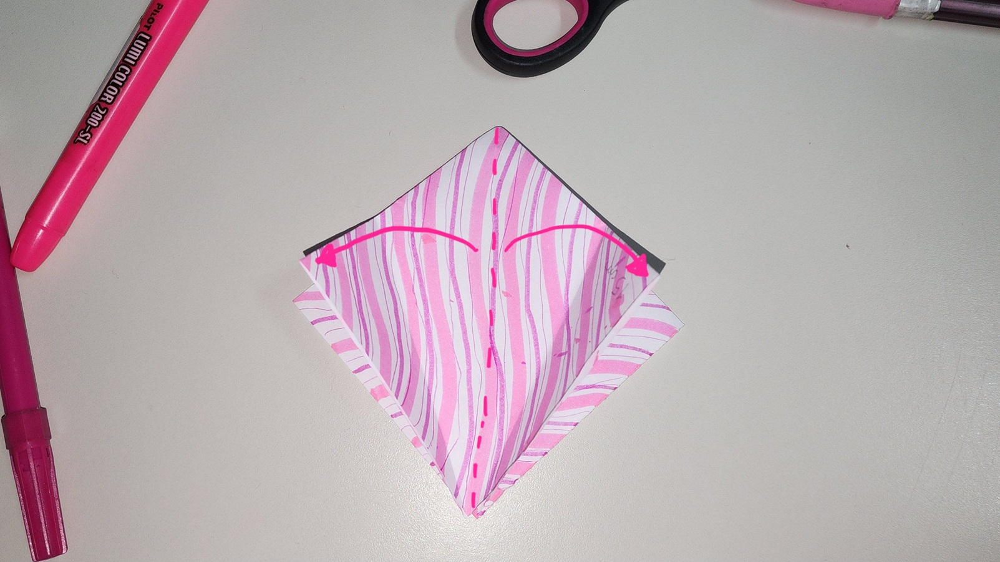

# Manual de Dobragem de Tsuru (34 Passos)

Este manual detalha passo a passo como dobrar um tsuru de papel, desde o corte inicial até os ajustes finais.

## Preparação do Papel

1.  **Obtenha uma folha de papel quadrado (idealmente 15 cm por 15 cm) e, se necessário, corte-a cuidadosamente utilizando uma régua e um estilete ou tesoura para garantir um corte preciso.**
    
2.  **Escolha o lado que você deseja que seja a cor principal do tsuru.**
3.  **Opcional: Pinte ou desenhe um dos lados da folha.** Se desejar um tsuru com cores diferentes nas asas ou no corpo, este é o momento de personalizar um dos lados. Deixe a tinta secar completamente antes de prosseguir.
    

## Dobraduras Base

4.  **Dobre o papel ao meio na diagonal, unindo os dois cantos opostos.** Faça um vinco firme e desdobre.
5.  **Dobre a outra diagonal, unindo os outros dois cantos opostos.** Faça um vinco firme e desdobre. Você terá agora duas linhas diagonais cruzando o centro do papel.
6.  **Vire o papel para que o lado colorido (ou pintado) fique virado para baixo.**
7.  **Dobre o papel ao meio horizontalmente, unindo as bordas superior e inferior.** Faça um vinco firme e desdobre.
8.  **Dobre o papel ao meio verticalmente, unindo as bordas esquerda e direita.** Faça um vinco firme e desdobre. Agora você terá duas cruzes de vincos no centro.**
    
9.  **Com os vincos feitos, traga os quatro cantos do papel em direção ao centro.** Utilize os vincos diagonais como guia para formar um quadrado menor. As bordas laterais se encontrarão no centro.**
    
    
10. **Achate o quadrado formado.** Você terá agora uma figura com quatro abas soltas na parte inferior. Esta é a base diamante.**
    

## Modelagem do Tsuru

11. **Segure a aba inferior (a que tem várias pontas) para baixo.**
12. **Dobre a borda lateral direita dessa aba em direção à linha central.** Faça um vinco firme.**
    
13. **Dobre a borda lateral esquerda dessa mesma aba em direção à linha central.** Faça um vinco firme. Você terá agora uma forma de "pipa".**
    
14. **Abra a aba superior da frente (a primeira "pipa" que você fez) na parte inferior.** Você verá uma dobra central.**
    
15. **Dobre a ponta inferior dessa aba para cima, seguindo o vinco central até encontrar o topo da "pipa".** Faça um vinco firme.**
    
    
    
16. **Vire o modelo.**
    
17. **Repita a partir do passo 12 no outro lado.**
    
    
    
    
18. **Repita o passo 12 e 13 nos dois lados (frente e verso).**
    
    
    
19. **Vire o tsuru como na imagem e abra.**
    
    
    **Você terá agora uma forma alongada com duas "pernas" na parte inferior. Esta é a base pássaro.**
    

## Abrindo as Asas

20. **Leve a ponta inferior até o topo.**
    
21. **Vire o tsuru e repita o processo.**
    
22. **Junte as duas laterais.**
    
    
23. **Vire e repita.**
    
    **O resultado será esse\!**
    

## Formando a Cabeça e a Cauda

24. **Segure uma das "pernas" na parte superior e puxe para formar uma linha reta em relação ao corpo.**
    
25. **Repita o processo na outra perna.**
    
26. **Dobre a ponta de uma "perna" para baixo e para fora, formando um pequeno ângulo.** Este será o pescoço e a cabeça do tsuru.**
    

## Ajustes Finais

27. **Agora dobre a ponta de cima para baixo, o máximo que der (cuidado para não rasgar).**
    
28. **Vire e repita do outro lado.**
    
29. **Seu tsuru de papel está pronto\!**
    
